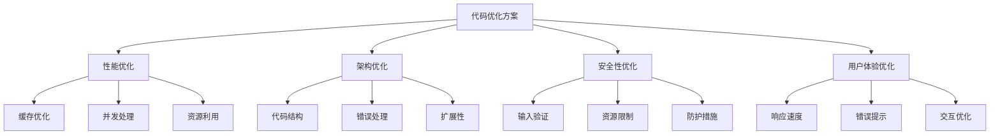

# Web内容提取工具优化方案

## 优化概述



## 1. 后端优化 (api/extract.py)

### 1.1 缓存机制优化

```python
# 添加分布式缓存支持
from redis import Redis
from functools import lru_cache

# Redis缓存配置
redis_client = Redis(
    host='localhost',
    port=6379,
    db=0,
    decode_responses=True
)

# 双层缓存：内存 + Redis
@lru_cache(maxsize=1000)
async def fetch_url(url: str) -> str:
    # 检查Redis缓存
    cached_content = redis_client.get(f"url:{url}")
    if cached_content:
        return cached_content
        
    # 获取新内容
    content = await fetch_from_source(url)
    
    # 存入Redis，设置过期时间
    redis_client.setex(f"url:{url}", 3600, content)
    
    return content
```

### 1.2 错误处理优化

```python
# 自定义错误类型
class URLFetchError(Exception):
    """URL获取错误"""
    pass

class ContentExtractionError(Exception):
    """内容提取错误"""
    pass

class FormatConversionError(Exception):
    """格式转换错误"""
    pass

# 添加重试机制
from tenacity import retry, stop_after_attempt, wait_exponential

@retry(
    stop=stop_after_attempt(3),
    wait=wait_exponential(multiplier=1, min=4, max=10),
    retry=retry_if_exception_type(URLFetchError)
)
async def fetch_url(url: str) -> str:
    try:
        # 现有代码
    except Exception as e:
        raise URLFetchError(f"Failed to fetch URL: {str(e)}")
```

### 1.3 并发处理优化

```python
# 并发控制
from asyncio import Semaphore
from typing import List

# 限制并发请求数
request_semaphore = Semaphore(10)
extraction_semaphore = Semaphore(5)

async def fetch_url(url: str) -> str:
    async with request_semaphore:
        # 获取内容
        
async def extract_content(html: str) -> str:
    async with extraction_semaphore:
        # 提取内容
```

### 1.4 内容提取优化

```python
# 增强的内容清理
def clean_content(html: str) -> str:
    soup = BeautifulSoup(html, 'html.parser')
    
    # 移除脚本和样式
    for tag in soup.find_all(['script', 'style']):
        tag.decompose()
    
    # 移除隐藏元素
    for hidden in soup.find_all(style=lambda x: x and ('display:none' in x or 'visibility:hidden' in x)):
        hidden.decompose()
    
    # 移除空白节点
    for element in soup.find_all(text=lambda text: isinstance(text, str) and not text.strip()):
        element.extract()
    
    # 移除广告相关元素
    ad_classes = ['ad', 'advertisement', 'banner', 'adsense']
    for ad in soup.find_all(class_=lambda x: x and any(c in x.lower() for c in ad_classes)):
        ad.decompose()
    
    return str(soup)
```

## 2. 前端优化 (app/page.tsx)

### 2.1 性能优化

```typescript
// 组件懒加载
import dynamic from 'next/dynamic';

const ResultDisplay = dynamic(() => import('./components/ResultDisplay'), {
    loading: () => <LoadingSpinner />,
    ssr: false
});

// 虚拟滚动实现
import { VirtualScroll } from 'react-virtual';

const VirtualizedContent: React.FC<{content: string}> = ({ content }) => {
    const lines = content.split('\n');
    const rowVirtualizer = useVirtual({
        size: lines.length,
        parentRef,
        estimateSize: useCallback(() => 20, []),
        overscan: 5
    });
    
    return (
        <div ref={parentRef}>
            <div
                style={{
                    height: `${rowVirtualizer.totalSize}px`,
                    position: 'relative',
                }}
            >
                {rowVirtualizer.virtualItems.map(virtualRow => (
                    <div
                        key={virtualRow.index}
                        style={{
                            position: 'absolute',
                            top: 0,
                            left: 0,
                            width: '100%',
                            height: `${virtualRow.size}px`,
                            transform: `translateY(${virtualRow.start}px)`,
                        }}
                    >
                        {lines[virtualRow.index]}
                    </div>
                ))}
            </div>
        </div>
    );
};

// 防抖处理
import { debounce } from 'lodash';

const debouncedExtract = debounce(handleExtract, 300);
```

### 2.2 状态管理优化

```typescript
// 状态管理优化
interface ExtractorState {
    url: string;
    format: OutputFormat;
    result: ExtractResult | null;
    loading: boolean;
    error: string | null;
    progress: number;
}

const ExtractorContext = React.createContext<{
    state: ExtractorState;
    dispatch: React.Dispatch<ExtractorAction>;
} | null>(null);

// 状态reducer
type ExtractorAction =
    | { type: 'SET_URL'; payload: string }
    | { type: 'SET_FORMAT'; payload: OutputFormat }
    | { type: 'SET_RESULT'; payload: ExtractResult }
    | { type: 'SET_LOADING'; payload: boolean }
    | { type: 'SET_ERROR'; payload: string | null }
    | { type: 'SET_PROGRESS'; payload: number };

function extractorReducer(state: ExtractorState, action: ExtractorAction): ExtractorState {
    switch (action.type) {
        case 'SET_URL':
            return { ...state, url: action.payload };
        case 'SET_FORMAT':
            return { ...state, format: action.payload };
        case 'SET_RESULT':
            return { ...state, result: action.payload };
        case 'SET_LOADING':
            return { ...state, loading: action.payload };
        case 'SET_ERROR':
            return { ...state, error: action.payload };
        case 'SET_PROGRESS':
            return { ...state, progress: action.payload };
        default:
            return state;
    }
}
```

### 2.3 错误处理优化

```typescript
// 错误边界组件
class ErrorBoundary extends React.Component<
    { children: React.ReactNode },
    { hasError: boolean; error: Error | null }
> {
    state = { hasError: false, error: null };
    
    static getDerivedStateFromError(error: Error) {
        return { hasError: true, error };
    }
    
    componentDidCatch(error: Error, errorInfo: React.ErrorInfo) {
        console.error('Error caught by boundary:', error, errorInfo);
    }
    
    render() {
        if (this.state.hasError) {
            return (
                <div className="error-container">
                    <h2>出错了！</h2>
                    <p>{this.state.error?.message}</p>
                    <button onClick={() => this.setState({ hasError: false })}>
                        重试
                    </button>
                </div>
            );
        }
        
        return this.props.children;
    }
}
```

## 3. 架构优化

### 3.1 中间件层

```typescript
// API请求拦截器
import axios, { AxiosRequestConfig, AxiosResponse } from 'axios';

const api = axios.create({
    baseURL: '/api',
    timeout: 15000,
});

// 请求拦截器
api.interceptors.request.use(
    (config: AxiosRequestConfig) => {
        // 添加请求ID
        config.headers['X-Request-ID'] = generateRequestId();
        
        // 添加时间戳
        config.headers['X-Timestamp'] = Date.now();
        
        return config;
    },
    (error) => {
        return Promise.reject(error);
    }
);

// 响应拦截器
api.interceptors.response.use(
    (response: AxiosResponse) => {
        // 响应数据转换
        if (response.data.success) {
            return response.data;
        }
        return Promise.reject(new Error(response.data.error));
    },
    (error) => {
        // 统一错误处理
        return Promise.reject(getErrorMessage(error));
    }
);
```

### 3.2 服务层

```typescript
// 抽象API服务
class ExtractorService {
    private api: AxiosInstance;
    
    constructor() {
        this.api = axios.create({
            baseURL: '/api',
            timeout: 15000,
        });
    }
    
    async extract(url: string, format: OutputFormat): Promise<ExtractResult> {
        try {
            const response = await this.api.get('/extract', {
                params: { url, output_format: format }
            });
            return response.data;
        } catch (error) {
            throw new ExtractError(getErrorMessage(error));
        }
    }
    
    async validateUrl(url: string): Promise<boolean> {
        try {
            new URL(url);
            return true;
        } catch {
            return false;
        }
    }
}
```

## 4. 安全性优化

### 4.1 输入验证

```typescript
// URL验证
const validateUrl = (url: string): boolean => {
    try {
        const parsedUrl = new URL(url);
        return ['http:', 'https:'].includes(parsedUrl.protocol);
    } catch {
        return false;
    }
};

// 内容长度限制
const MAX_CONTENT_LENGTH = 1024 * 1024; // 1MB
const MAX_URL_LENGTH = 2048; // 标准URL最大长度
```

### 4.2 请求限制

```python
# FastAPI速率限制
from fastapi import FastAPI, Request
from slowapi import Limiter, _rate_limit_exceeded_handler
from slowapi.util import get_remote_address
from slowapi.errors import RateLimitExceeded

limiter = Limiter(key_func=get_remote_address)
app = FastAPI()
app.state.limiter = limiter
app.add_exception_handler(RateLimitExceeded, _rate_limit_exceeded_handler)

@app.get("/api/extract")
@limiter.limit("60/minute")
async def extract_content(request: Request, url: str):
    # 验证URL长度
    if len(url) > MAX_URL_LENGTH:
        raise HTTPException(status_code=400, detail="URL too long")
    
    # 验证内容大小
    content_length = len(await fetch_url(url))
    if content_length > MAX_CONTENT_LENGTH:
        raise HTTPException(status_code=400, detail="Content too large")
```

## 5. 用户体验优化

### 5.1 加载状态优化

```typescript
// 加载状态管理
type LoadingState = 'idle' | 'validating' | 'fetching' | 'extracting' | 'converting';

const [loadingState, setLoadingState] = useState<LoadingState>('idle');
const [progress, setProgress] = useState<number>(0);

// 进度指示器组件
const ProgressIndicator: React.FC<{state: LoadingState; progress: number}> = ({
    state,
    progress
}) => {
    const getStateMessage = () => {
        switch (state) {
            case 'validating': return '正在验证URL...';
            case 'fetching': return '正在获取网页内容...';
            case 'extracting': return '正在提取核心内容...';
            case 'converting': return '正在转换格式...';
            default: return '';
        }
    };
    
    return (
        <div className="progress-container">
            <div className="progress-bar" style={{width: `${progress}%`}} />
            <div className="progress-message">{getStateMessage()}</div>
        </div>
    );
};
```

### 5.2 错误提示优化

```typescript
// 错误处理工具
const getErrorMessage = (error: any): string => {
    if (error.response) {
        switch (error.response.status) {
            case 400: return '请求参数错误，请检查URL格式';
            case 404: return '无法访问目标网页，请确认URL是否正确';
            case 429: return '请求过于频繁，请稍后再试';
            case 500: return '服务器处理失败，请稍后重试';
            case 503: return '服务暂时不可用，请稍后再试';
            default: return `提取失败 (${error.response.status})`;
        }
    }
    
    if (error.request) {
        return '网络连接失败，请检查网络设置';
    }
    
    return '发生未知错误，请重试';
};

// 错误提示组件
const ErrorDisplay: React.FC<{error: string}> = ({ error }) => {
    return (
        <div className="error-container" role="alert">
            <div className="error-icon">⚠️</div>
            <div className="error-message">{error}</div>
            <button className="error-dismiss" onClick={() => setError(null)}>
                关闭
            </button>
        </div>
    );
};
```

## 6. 性能监控

### 6.1 前端性能监控

```typescript
// 性能监控工具
const usePerformanceMonitor = () => {
    useEffect(() => {
        const observer = new PerformanceObserver((list) => {
            for (const entry of list.getEntries()) {
                // 记录性能指标
                console.log(`${entry.name}: ${entry.startTime}ms`);
            }
        });
        
        observer.observe({ entryTypes: ['measure', 'paint'] });
        
        return () => observer.disconnect();
    }, []);
};

// 使用示例
performance.mark('extractStart');
await handleExtract();
performance.mark('extractEnd');
performance.measure('提取耗时', 'extractStart', 'extractEnd');
```

### 6.2 后端性能监控

```python
# 性能监控中间件
import time
from fastapi import Request
from prometheus_client import Counter, Histogram

# 请求计数器
REQUEST_COUNT = Counter(
    'http_requests_total',
    'Total HTTP requests',
    ['method', 'endpoint', 'status']
)

# 响应时间直方图
REQUEST_LATENCY = Histogram(
    'http_request_duration_seconds',
    'HTTP request duration in seconds',
    ['method', 'endpoint']
)

@app.middleware("http")
async def monitor_requests(request: Request, call_next):
    start_time = time.time()
    response = await call_next(request)
    duration = time.time() - start_time
    
    REQUEST_COUNT.labels(
        method=request.method,
        endpoint=request.url.path,
        status=response.status_code
    ).inc()
    
    REQUEST_LATENCY.labels(
        method=request.method,
        endpoint=request.url.path
    ).observe(duration)
    
    return response
```

这些优化建议涵盖了性能、安全性、可维护性和用户体验等多个方面。建议根据实际需求和资源情况，选择性地实施这些优化方案。每个优化方案都包含了详细的代码示例和实现说明，可以根据具体情况进行调整和采用。 